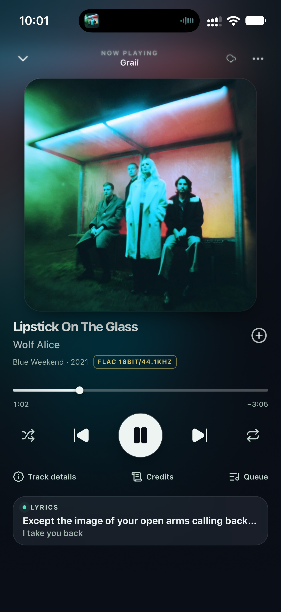
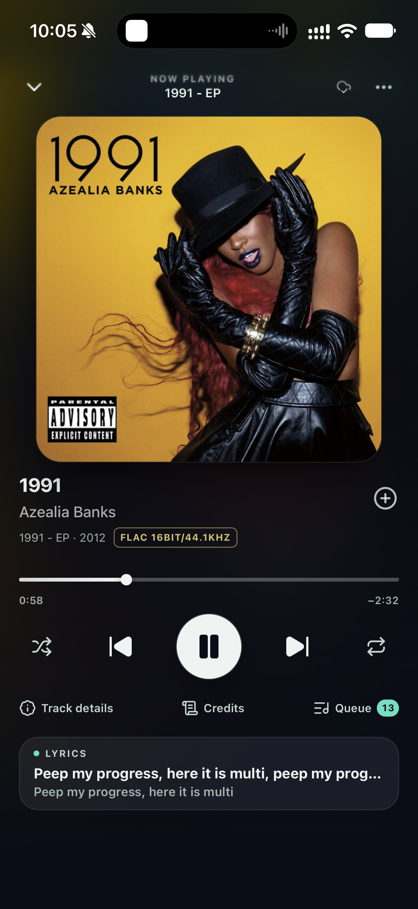

# Halflight

[](https://github.com/soulwax/halflight.eu/actions/workflows/ci.yml)

Halflight ([halflight.eu](https://halflight.eu)) is a listening room built around TIDAL. Anyone can deploy their own
copy, and anyone can sign in at halflight.eu with their own TIDAL account and start listening. The player and its listening session (now playing, queue, history and resume position) are the
product; every route exists to feed it. _Syn_ is the code name, so the package, tables, env vars and API paths keep
`syn`.

| Now playing                                                                                                          | Compact now playing                                                                                                          |
| -------------------------------------------------------------------------------------------------------------------- | ---------------------------------------------------------------------------------------------------------------------------- |
|  |  |

## Features

- **Open to everyone** — sign-up is open and every listener is isolated: their own TIDAL connection, playback
  session, playlists and caches, with per-user request limits protecting the shared TIDAL app. Only `/app/admin`
  requires an administrator.
- **Two sites, one session** — a desktop Listening Room (`/app`) and a mobile PWA, Halflight Now, sharing one
  player and one server-authoritative playback session (queue, history and position survive reloads and devices).
- **Direct playback** — audio is proxied through the server, with Range support and automatic quality fallback
  from hi-res to lossless, high and low. The browser never receives a token or a TIDAL media URL.
- **Synced lyrics** — the active line follows the playhead, with the next line shown as a smaller caption.
- **Verified imports** — TIDAL imports resolve recording metadata by ID and check playback before saving.
  Unavailable IDs are matched to playback-checked catalogue candidates, preferring the same ISRC and
  allowing compatible best fits after checking title, artist, edition and duration. Source order and repeated playable songs are preserved. Refreshing an unchanged TIDAL import pulls updates without publishing the filtered copy.
- **Interactive recording repair** — when a song cannot play, choose a verified alternative in the mobile or
  desktop player. Preview the match, update a selected local playlist, or play without changing it. Confirmed
  replacements survive later imports; the TIDAL source playlist stays unchanged.
- **Search listening history** — recent search songs appear only after their audio actually plays. The list
  is separate from search results and the player's listening history, and is saved per account on this device.
- **Deterministic taste engine** — explainable set generation from your own library. Nothing is sent to an LLM, and
  nothing is written to TIDAL without review.
- **Optional extras** — Last.fm scrobbling, playlist export, private music upload and a Redis cache, each off until
  configured.
- **Mobile storage controls** — Settings shows private-music capacity, saved playlists, listening-session
  counts and saved preferences. Download private-music manifests directly, or create, download and delete
  an account-protected 15-minute export when export storage is configured. Storage failures are reported
  separately so other controls remain usable. `/api/storage` exposes the same authenticated summaries.

## Stack

SvelteKit with Svelte 5 (runes), TypeScript, Tailwind CSS v4, PostgreSQL (Neon) through Drizzle, Better Auth,
Paraglide (`en`, `de-DE`), and [`bragi-audio`](https://www.npmjs.com/package/bragi-audio) for the browser player
engine. Package manager: **pnpm only**. See [`AGENTS.md`](AGENTS.md) for conventions and [`CLAUDE.md`](CLAUDE.md)
for the architecture map; product direction is in [`MASTERPLAN.md`](MASTERPLAN.md).

## Getting started

Requires **Node 22 or 24** and a Postgres database.

```sh
pnpm install
cp .env.example .env     # then fill it in; every variable is declared in src/env.ts
pnpm db:migrate
pnpm dev                 # port per ORIGIN in .env, default :3000
```

Sign-up is open. Today the account matching `ADMIN_USERNAME` becomes the owner, and only administrators can use
the product routes; opening them to every signed-in listener is the planned change.

### Commands

```sh
pnpm check               # svelte-check
pnpm lint                # prettier + eslint
pnpm lint:types          # type-aware eslint (slower)
pnpm format
pnpm test:unit           # client and server projects
pnpm test:storybook
pnpm test:e2e            # Playwright
pnpm build               # Node build in build/
pnpm build:vercel        # Vercel build
```

Client and Storybook tests need Playwright's Chromium (`pnpm exec playwright install chromium`). CI runs check,
lint, unit tests, Storybook tests and a build on every push and pull request.

## TIDAL connection

Halflight keeps two independent, encrypted, auto-refreshing TIDAL tokens per user in `tidal_auth`. All
token logic lives under [`src/lib/server/tidal/`](src/lib/server/tidal) and never reaches the browser.

| Token    | Flow                                             | Used for                               |
| -------- | ------------------------------------------------ | -------------------------------------- |
| Browse   | OAuth authorization code + PKCE (developer app)  | Catalogue, library and search (v2 API) |
| Playback | TIDAL device authorization (TIDAL Link, `r_usr`) | Streaming, lyrics and credits (v1 API) |

### 1. Register a TIDAL app

At <https://developer.tidal.com>, create an app and note the client ID (and the secret, for a confidential app). Add
these redirect URIs exactly:

- `http://localhost:3000/tidal/callback` for development
- `https://<your-domain>/tidal/callback` for production
- `http://localhost:3000/api/auth/callback/tidal` and `https://<your-domain>/api/auth/callback/tidal` for
  **Continue with TIDAL** on the sign-in page

The same app powers sign-in: a listener who signs in with TIDAL gets the browse token stored immediately and
lands on **Settings → TIDAL** to pair playback. GitHub and email remain available as secondary sign-in options.

The default scope request is read-only: `user.read entitlements.read collection.read playlists.read
recommendations.read search.read`. Some scopes need approval from TIDAL.

### 2. Configure the environment

| Variable              | Required               | Notes                                                                                                          |
| --------------------- | ---------------------- | -------------------------------------------------------------------------------------------------------------- |
| `TIDAL_CLIENT_ID`     | yes                    | From the developer portal.                                                                                     |
| `TIDAL_CLIENT_SECRET` | confidential apps only | Sent in the token request body.                                                                                |
| `TIDAL_REDIRECT_URI`  | no                     | Defaults to `${ORIGIN}/tidal/callback`. Must match the portal exactly.                                         |
| `TIDAL_SCOPES`        | no                     | Space-separated. Defaults to the read-only set above.                                                          |
| `TIDAL_TOKEN_ENC_KEY` | yes                    | 32-byte base64 key (`openssl rand -base64 32`). Keep it stable: changing it makes stored tokens undecryptable. |
| `DATABASE_URL`        | yes                    | Postgres. Tokens are stored as encrypted ciphertext only.                                                      |

Set the same variables in your host for every environment that serves the app.

### 3. Connect

Sign in as the administrator, open **Settings → TIDAL**, and connect the browse token, then pair the playback token
with the device code shown there. **Disconnect** deletes the stored row (TIDAL has no revocation endpoint).

The browser can read any v2 endpoint through the authenticated, read-only proxy at `/tidal/api/<path>`; tokens stay
on the server.

### Tests

```sh
pnpm exec vitest run --project server src/lib/server/tidal
```

These cover encryption round trips and tamper detection, expiry and refresh with rotation, concurrent-refresh
coalescing and the 401 retry, using an in-memory store, so no database or network is needed.

## Deployment

The default target is Vercel. For self-hosting, `ADAPTER=node` builds `build/`, managed by PM2:

```sh
pnpm pm2:start           # migrate, build, start
pnpm pm2:reload          # migrate, build, reload with updated env
```

Production has no durable local filesystem: owned state lives in Postgres, and optional buckets handle exports,
private music and the hi-res segment cache.

### Listening taste profile

The player contributes artist and genre evidence only after **more than 30 seconds of actual playback**. Pauses, buffering, seeks, and events from the previous audio source do not qualify. Each listening event has an opaque receipt so repeated delivery cannot add credit twice. Collaborating artists share one play's credit; genre tags share that same credit. Daily artist repeats receive diminishing credit and stop adding weight after six observations, with a 90-day half-life for older evidence.

Connected Last.fm recent scrobbles provide a weaker prior. The latest 200 observations are deduplicated by recording MBID, or full title and artist when unavailable. Repeat interest is `min(2, 1 + 0.25 × log2(repeats))`, with the same age decay. Current “now playing” entries are excluded. Last.fm timestamps do not establish exact listening duration, so these are separate from app-qualified plays. Genre evidence uses recognized Last.fm genre tags; missing tags stay unknown. Stored evidence contains artist IDs, genre weights, counters, and opaque receipts rather than a second song history. Profile reset clears these aggregates.

Apply migration `0029_qualified_listening_evidence.sql` before deploying this change. Playlist editing supports adding, removing, reordering, undoing, and duplicating local playlists with revision checks. Locally edited imports are protected from bulk refresh overwrites. Covers combine the first four distinct albums; playlists with fewer albums use their first album.
