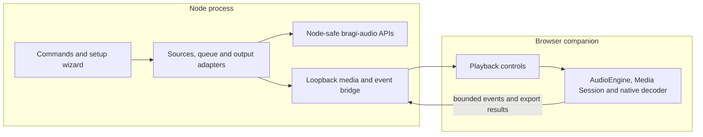

# Bragi CLI implementation plan

Implementation and the first public release are complete as `bragi-cli@0.1.0`. Source and release
notes are published at [github.com/soulwax/bragi-cli](https://github.com/soulwax/bragi-cli); install
and usage details are in [README.md](README.md). The acceptance gates below record the completed
first release. Native mpv/FFmpeg adapters remain future work.

Reviewed against `bragi-audio@0.2.2` on 2026-09-29.

## Product and naming

Build a friendly audio toolbox with the npm package name **`bragi-cli`**, the primary command
**`bragi`**, and an additional **`bragi-cli`** binary pointing to the same entry point. Keep its
source at the root of the **`soulwax/bragi-cli`** repository. The npm package name was checked when
version 0.1.0 was published; package name availability is not a reservation. The command name can differ from the package
name, and the second binary gives users an alternative if `bragi` already exists on their PATH.

The main jobs are inspecting audio, downloading permitted sources, streaming bytes, converting
supported WAV files, and playing a queue. A first-run wizard makes the useful defaults discoverable;
every command also works with explicit flags and without a saved configuration.

This is a standalone consumer of `bragi-audio`, with its own filesystem and terminal adapters. It
does not import Syn routes, database code, credentials, environment configuration, or display models.
Syn's production storage rules remain unchanged. CLI preferences and explicitly requested output
files belong on the user's machine.

## Runtime and package boundary

Use TypeScript strict mode, ESM, and Node **22.13 or later**. Develop on Node 24; the package’s
minimum Node version is checked in CI.
[Node release schedule](https://nodejs.org/en/about/previous-releases).

The tested runtime dependencies are:

| Dependency          | Responsibility                                                  |
| ------------------- | --------------------------------------------------------------- |
| `bragi-audio@0.2.2` | Audio facts, transfer bounds/retries, queue helpers and codecs  |
| `commander`         | Commands, typed option parsing, generated help and usage errors |
| `@clack/prompts`    | Setup questions, choices, cancellation and interactive progress |
| `env-paths`         | Platform-appropriate configuration and temporary directories    |
| `open`              | Open the local playback companion in the user's browser         |

Commander supports strict argument handling and configurable output/exit handling. Clack provides
the prompt and cancellation primitives needed by the wizard. Keep prompt rendering in the terminal layer so ordinary scripts get clean output.
[Commander documentation](https://github.com/tj/commander.js),
[Clack documentation](https://github.com/bombshell-dev/clack/blob/main/packages/prompts/README.md).

Use `env-paths('bragi-cli')` and document the paths it returns rather than hard-coding Linux paths.
Use `open` for browser launching, with a printed local URL as a fallback.
[env-paths documentation](https://github.com/sindresorhus/env-paths),
[open documentation](https://github.com/sindresorhus/open).

The standalone repository declares its own `pnpm-workspace.yaml`. It depends on the published
library, not a neighboring checkout or Git submodule path. It builds plain Node ESM with `tsc` and
uses esbuild to bundle the browser companion. The npm package includes `dist` and release/license
documentation.

The published package identity and executable mapping are:

```json
{
  "name": "bragi-cli",
  "version": "0.1.0",
  "type": "module",
  "repository": {
    "type": "git",
    "url": "git+https://github.com/soulwax/bragi-cli.git"
  },
  "engines": { "node": ">=22.13.0" },
  "bin": {
    "bragi": "./dist/cli.js",
    "bragi-cli": "./dist/cli.js"
  },
  "files": ["dist", "README.md", "CHANGELOG.md", "LICENSE"],
  "dependencies": { "bragi-audio": "0.2.2" }
}
```

The entry has `#!/usr/bin/env node`; the packed executable retains its shebang and executable
permissions. The first implementation was developed in Syn’s `bragi/` directory, then published as
its own repository so the public source contains only the standalone CLI.

## Command experience

Implemented commands and examples:

```sh
pnpm add -g bragi-cli                 # after the first public release
bragi                               # first-run setup, then an action menu, on a TTY
bragi setup                         # configure or revise preferences
bragi doctor                        # explain available capabilities and missing prerequisites
bragi formats                       # supported containers, MIME aliases and extensions
bragi inspect ./track.flac
bragi inspect ./Music --recursive --jsonl
bragi inspect ./track.flac --artwork ./covers
bragi download https://example.org/track.flac --output ./track.flac
bragi download --url-env BRAGI_MEDIA_URL --headers-env BRAGI_MEDIA_HEADERS --output ./track.flac --resume
bragi stream https://example.org/track.flac --stdout > ./track.flac
bragi wav inspect ./track.wav
bragi wav convert ./track.wav --encoding pcm24 --output ./track-24.wav
bragi wav decode ./track.wav --output ./samples.f32 --metadata ./samples.json
bragi wav encode ./samples.f32 --sample-rate 48000 --channels 2 --output ./track.wav
bragi play ./one.flac ./two.mp3
bragi play --queue ./mix.bragi.json
bragi queue add ./mix.bragi.json ./another.wav
bragi queue list ./mix.bragi.json
bragi config show --json
```

The examples describe the intended interface, not commands already implemented. Queue subcommands
edit a local playlist file; live playback controls initially belong to the running `play` session.
Avoid introducing a background daemon merely to support separate control commands.

Use human-readable output by default: title/artist, container/codec, duration, sample rate, bit
depth, channels, warnings, and a clear result path. Show transfer progress with bytes and elapsed
time; show a percentage only when the total is known. Each command's help includes a small working
example and the related next command.

Automation rules:

- `--json` emits one versioned result object; batch inspection uses `--jsonl`, one result per input.
- Results and binary bytes use stdout; prompts, progress and diagnostics use stderr. Disable
  decoration for redirected output and respect `NO_COLOR`.
- Explicit commands run with defaults and never force setup. `bragi` without arguments prints help
  when stdin or stdout is not a TTY. `setup` without a TTY requires `--yes` and explicit/defaultable
  options; it never waits for input.
- `--quiet`, `--no-interactive`, `--max-bytes`, `--timeout`, and `--output` have consistent meanings.
  Accept clear size units such as `128MiB`. Binary stdout requires explicit `--stdout` and is refused
  on a terminal unless deliberately forced.
- Errors explain the problem and a concrete recovery action. JSON errors contain a stable CLI code
  and sanitized details; never print raw fetch errors or authorization headers.
- Ctrl+C aborts transfers, terminates parser workers, stops the player, closes files/server sockets,
  and restores terminal mode. Keep resumable partials only when resume was explicitly requested.

Reserve exit codes: `0` success, `1` invalid/unsupported audio or strict validation failure, `2`
usage error, `3` network/authentication failure, `4` filesystem/configuration failure, `5` unavailable
or failed playback backend, and `130` interruption. Batch commands finish with a nonzero status if
any input failed, while retaining a useful result for every processed input.

## Setup wizard

Target a short offline-first flow. No account is required for local audio or public media URLs.

1. **Welcome and purpose.** Offer “Listen”, “Inspect and convert”, or “Both”. This changes shortcuts,
   not command availability.
2. **Check capabilities.** Check Node, the library version, configuration location and selected
   directories. Detect an existing mpv installation if present. Browser launching is a capability
   to try explicitly, not proof that a sound device or decoder works.
3. **Playback choice.** Recommend the bundled browser companion. Offer an installed mpv backend once
   that adapter exists, or “Configure playback later”. Missing playback tools do not block inspection,
   downloading or WAV conversion. Do not automatically install native software.
4. **Output location.** Suggest a downloads directory, allow a different path, and validate its parent.
   Create directories only when the user saves the setup or requests an output.
5. **Limits and output.** Default to 128 MiB input/transfer/encoded-output limits and a separate
   128 MiB expanded-PCM limit, matching the library defaults. Label these as data limits, not a
   guaranteed process RAM ceiling. Keep detailed settings behind an “Advanced” choice.
6. **Overwrite and artwork preferences.** Default to no overwriting and no embedded artwork extraction.
   Artwork remains an explicit operation with an aggregate byte/count bound.
7. **Review and save.** Show the exact non-secret preferences and configuration path. Save one
   versioned JSON document atomically. Cancelling any step leaves the previous configuration intact.
8. **First useful action.** Offer “Inspect a file”, “Play a file”, or “Finish”. Run an offline codec
   self-check using a tiny generated WAV. An audible test is optional and requires a deliberate Play
   action in the browser, where autoplay policy applies.

Example conclusion:

```text
Bragi is ready
Playback      Browser companion
Downloads     /chosen/directory
Largest file  128 MiB
Artwork       Only when requested

Try: bragi inspect ./track.flac
     bragi play ./track.flac
```

Keep a small `CliConfig` schema: version, playback backend, output directory, transfer/PCM limits,
timeout and display preferences. Flags override CLI-specific environment values, then saved
preferences, then built-in defaults. Unknown schema versions produce an actionable error;
`config path/show/reset` operate only on Bragi's configuration.

Do not put bearer tokens or private signed media URLs in the configuration, playlists, journals or
logs. Public URLs can be command arguments; private sources use an environment reference, masked
session prompt or stdin. Persistent credential integration and provider-specific login are separate
future features, not wizard requirements.

## Practical library coverage

| Library feature                                            | CLI use                                                                    | Boundary                                                                                                                          |
| ---------------------------------------------------------- | -------------------------------------------------------------------------- | --------------------------------------------------------------------------------------------------------------------------------- |
| `AUDIO_FORMATS`, MIME/extension lookup                     | `formats`, discovery filters, hints and output extensions                  | Byte inspection remains authoritative                                                                                             |
| `detectAudioFormat`                                        | Fast detection and transfer-prefix checks                                  | Detection does not prove decodability                                                                                             |
| `analyzeAudio`                                             | Small bounded buffers, stdin and small remote inputs                       | Default artwork remains off                                                                                                       |
| `analyzeWebStream`                                         | Inspection from an open regular-file handle with its stat size             | Convert Node streams to Web streams; unknown remote size uses a bounded buffer instead                                            |
| Normalized tags, technical metadata, warnings and artwork  | `inspect`, JSON output and explicit artwork export                         | Never expose raw parser documents                                                                                                 |
| `fetchAudioStream`                                         | Downloads, binary streaming and the playback media bridge                  | Stream to disk/client with backpressure rather than buffering whole tracks                                                        |
| `downloadAudio`                                            | Small bounded conversion inputs and explicit in-memory operations          | Not the ordinary large-file download path                                                                                         |
| Transient retry helpers                                    | Transfers and narrowly scoped read adapters                                | Do not add a second retry loop around already-retried fetches                                                                     |
| Byte ranges and conditional-request helpers                | Resume validation and local playback seeking                               | CLI supplies HTTP status/header handling and representation identity                                                              |
| `decodeWav`, `encodeWav`                                   | WAV validation, re-encoding and documented float32 PCM import/export       | Mono/stereo PCM16, PCM24 and float32; preserve rate and channels                                                                  |
| `AudioEngine`, `loadBlob`, volume and `replayGainToLinear` | Browser playback and converted-audio preview; explicit gain input          | DOM APIs run in the companion, not Node; automatic ReplayGain tag extraction is not currently in the normalized metadata contract |
| Queue entry identities and `rebaseQueue`                   | Duplicate tracks, playlist edits and shared terminal/browser queue actions | One coordinator applies bounded commands; no distributed queue service                                                            |
| `StreamLoader`, `StreamPreloader`                          | Validated local companion metadata and look-ahead information              | Cache metadata only; manage request cancellation in the caller                                                                    |
| `assessPlayback`                                           | Duration checks and readable playback issues                               | Quality comparisons require real source-provided tiers; do not invent them                                                        |
| Media Session helpers                                      | Browser media keys, metadata, position and playback state                  | Best effort; capability checks determine availability                                                                             |
| `decodeAudio`                                              | Explicit browser-backed decoding/export for browser-supported formats      | Complete-file decode, browser-dependent codecs and browser-owned decoded memory                                                   |

The current API contracts are in the
[library README](../bragi-audio/README.md),
[metadata exports](../bragi-audio/src/index.ts),
[player exports](../bragi-audio/src/player/index.ts),
[delivery exports](../bragi-audio/src/delivery/index.ts), and
[codec exports](../bragi-audio/src/audio/index.ts).

## Files, transfers and conversion

Inspect local files through an open handle, validated stat size and a Web stream. Node provides
`Readable.toWeb` and `Writable.toWeb` adapters, allowing the CLI to use the library without changing
its API. Put metadata parsing in a worker with a deadline: the library's abort checks do not make
synchronous parsing interruptible. Bound directory traversal and batch concurrency, and keep input
order stable in batch results. [Node Web Streams documentation](https://nodejs.org/api/webstreams.html).

Download to an exclusive sibling `.part` file, count actual bytes, verify completion, then publish
the final file with tested no-clobber semantics. A plain `rename` can overwrite an existing file;
the filesystem adapter must implement the chosen platform behavior deliberately. `--force` is the
explicit overwrite choice. Output names derived from server headers must be sanitized; a supplied
output path is never silently replaced with an upstream filename.

Resume only when the journal has a usable strong ETag and the caller supplies the source again.
Send `Range` and `If-Range`; append only after validating `206`, the matching `Content-Range` start,
representation validator and total limit. A `200` restarts from zero rather than being appended.
Changed, absent or weak validators cause a clean restart decision; `416` is not automatically treated
as a completed download. The limit applies to the final size including existing partial bytes.
The journal stores local paths, an opaque source reference, validator and byte count, not a private
source URL or credentials. Request identity encoding and refuse unsafe compressed-range resumes.

`--headers-env` reads a validated JSON header map from an environment variable. Reserve transfer
headers such as `Range` and `If-Range` for the command's own logic, and keep authorization values
inside the Node process. This exposes the delivery API's header support without requiring secrets
in command-line arguments or saved preferences.

WAV conversion calls `decodeWav` then `encodeWav`, mapping `pcm16`, `pcm24`, and `float32` to bit depths
16, 24 and 32. Preserve sample rate and channel count; the library is not a resampler, downmixer or
compressed encoder. Re-encoding creates a new audio RIFF document and does not preserve tags,
artwork or unknown chunks; report that as an output warning. Raw PCM commands document float32
little-endian interleaved samples and the required sample-rate/channel metadata. Validate alignment,
finite samples, input size, decoded PCM size and output size before committing a destination.

## Playback and browser decoding



`bragi play` keeps the queue and source mapping in the Node process and starts a short-lived server
on `127.0.0.1` with a random port. Serve a bundled, framework-independent page using
`bragi-audio/player`; open it in the browser and print its address. A visible Play button unlocks
audio. The terminal offers Space for pause/resume, n/p for next/previous, arrows for seeking,
+/- for volume, and q to stop, with a plain-text help alternative.

The server exposes only selected source IDs, metadata and media, not arbitrary filesystem paths
or an arbitrary upstream proxy. Node retains remote URLs and authorization headers; the page receives
an opaque same-origin media path. Validate Host/Origin, reject cross-origin control requests, and
use a per-session control nonce kept in memory and sent in request headers. Use server-sent events
for commands/state snapshots and bounded POST messages for browser events; keep one session owner.
Bind no LAN interface and ship no daemon, cloud account or public listener in the first release.

Local media supports GET/HEAD, single byte ranges, `206`/`416`, and conditional requests. Strong
ETags must identify actual bytes, not only a filename or quality label: compute a bounded streaming
digest and invalidate it if the opened file changes. The package helpers are not a full HTTP server;
define/test the adapter's handling of unsupported multi-range and date/weak-validator forms before
advertising conditional-request behavior. Remote playback uses the bounded delivery helper and
preserves valid range response headers. Cancel old requests when the current source changes.

Use `AudioEngine` for native streaming, `StreamLoader` for a whitelisted display contract, and
`StreamPreloader` for upcoming metadata. Keep Media Session state consistent with queue changes;
clear listeners, object URLs, requests and the local server on exit. Apply gain only from an explicit
setting or a supported source adapter; provide no automatic loudness analysis in this release.

An optional `bragi convert INPUT --backend browser --output OUTPUT.wav` reuses `decodeAudio` and
`encodeWav` in the companion, then sends the bounded WAV result to the Node output adapter.
Require an explicit browser action and a smaller complete-input limit for this mode. Verify the
decoded channel count and output size. Browser decoding can resample to its context; display the
selected output rate. Its native decode cannot be forcibly aborted and has no library-enforced
decoded-memory ceiling. Keep it out of unattended batch conversion; Node WAV conversion stays
fully terminal-based.

An installed **mpv** adapter is a later headless option, using argument-array spawning with
`shell: false` and JSON IPC over a private Unix socket or Windows named pipe. Feed it the same local
media bridge so private upstream URLs and credentials do not become process arguments. It shares
the queue/controller but does not pretend to use `AudioEngine` or Media Session. Socket lifecycle,
player termination and seek behavior need platform tests.
[mpv embedding and JSON IPC documentation](https://mpv.io/manual/stable/#json-ipc).

## Proposed source layout

```text
bragi/
  PLAN.md
  package.json                 # bragi-cli; bin bragi + bragi-cli
  pnpm-workspace.yaml          # independent workspace boundary
  pnpm-lock.yaml
  tsconfig.json
  tsconfig.build.json
  src/
    cli.ts                     # shebang, parser, dependency wiring, final exit code
    commands/                  # setup, doctor, formats, inspect, download, stream, wav, play, queue
    core/                      # typed results, sources, preferences, queue/controller, limits
    terminal/                  # prompts, progress, formatting, keyboard lifecycle
    adapters/                  # filesystem, fetch, config paths, browser launcher, optional mpv
    workers/inspect.ts         # metadata work and cancellation/deadline boundary
    companion/                 # loopback routes, HTML/CSS, browser entry, event protocol
  test/                        # generated fixtures, adapters, wizard, process and browser tests
  README.md
  CHANGELOG.md
  LICENSE
```

Define command handlers against injected I/O, fetch, prompts, clock, process launcher and config
store. Keep domain results independent of terminal rendering. The browser bundle imports only
`bragi-audio/player` and `bragi-audio/audio`, not the metadata root or Node adapters. Runtime worker
and companion asset URLs resolve relative to the installed entry, never the current directory.

## Delivery milestones and acceptance gates

1. **Scaffold and first useful slice — complete.** Create the independent package, bins, strict build,
   `--help`/`--version`, `formats`, local `inspect`, structured results and cancellation. Confirm
   the runtime floor and dependency versions. Gate: an installed tarball inspects a generated WAV
   from a directory outside the checkout and prints clean JSON without Syn configuration.
2. **Setup and diagnosis — complete.** Add the wizard, versioned preferences, doctor and interactive action menu.
   Gate: fresh setup, rerun, cancellation at every step, invalid paths, non-TTY invocation and
   configuration write failure behave deterministically with no half-written preferences.
3. **Delivery and WAV tools — complete.** Add bounded downloads/streaming, no-clobber output, validated resume,
   artwork export and WAV conversion/raw PCM operations. Gate: unknown lengths, truncated bodies,
   changed validators, ignored ranges, quota limits, aborts and disk failures leave valid outcomes;
   round-trips preserve sample rate/channels and respect the documented encoding tolerance.
4. **Playback companion — complete.** Add the loopback media bridge, queue/controller, native browser playback,
   Media Session, metadata preloading and terminal controls. Gate: real Chromium tests cover a WAV,
   range-based seeking, duplicate queue entries, next/previous, cancellation of obsolete requests,
   source rejection and cleanup. Default playback does not require mpv or FFmpeg.
5. **Browser conversion and usability pass — complete.** Add explicit browser decode/export; finish actionable
   errors, narrow-terminal/plain-text behavior and examples. Gate: a new user can install, finish
   setup, inspect a file, download a permitted test fixture and play a queue without reading source.
   Native decoding capabilities are reported from observed results, not metadata format labels.
6. **First public release — complete.** The runtime dependency audit and tarball checks passed.
   Both binaries work from a clean install on Node 22.13 and 24; CI passed on Linux, macOS and
   Windows. The package was published as [bragi-cli@0.1.0](https://www.npmjs.com/package/bragi-cli).
   Its source and release are published at [github.com/soulwax/bragi-cli](https://github.com/soulwax/bragi-cli).

After the first usable release, implement mpv only if terminal-only/headless playback is wanted.
General compressed transcoding needs a separately scoped FFmpeg adapter or future library API.
DRM, DASH/HLS assembly, TIDAL login, catalogue replication, tag editing, resampling and downmixing
are not capabilities of `bragi-audio@0.2.2` and must not appear as working CLI features.

Tests should exercise the CLI's actual boundaries: subprocess stdout/stderr/exit codes, simulated
wizard inputs, temporary-directory publication, an in-process HTTP fixture server, and the real
browser companion. Reuse generated WAV fixtures rather than downloading recordings. Avoid copying
the library's entire codec/parser suite into the CLI; test the orchestration and user-visible results.
